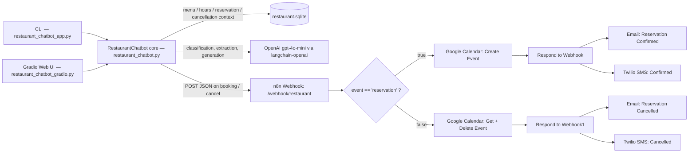

# 🌊 Tasty Sea — Restaurant Reservation Chatbot

A hybrid **Python + LangChain + SQLite** chatbot for a seafood restaurant, paired with an **n8n** automation workflow that turns confirmed bookings and cancellations into calendar events, confirmation emails, and SMS notifications.

The bot answers menu and hours questions from a live SQLite database, walks guests through booking or cancelling a table across multiple turns, and hands off every successful reservation event to n8n, which syncs Google Calendar and fires off Email + Twilio SMS receipts.


> 📸 This README references screenshots and a demo video from the `screenshots/` folder. Add your exported images there (filenames are listed in [Project Structure](#project-structure)) and they'll render inline on GitHub.

---

## Table of Contents

- [Overview](#overview)
- [Key Features](#key-features)
- [Demo](#demo)
- [Architecture](#architecture)
- [Project Structure](#project-structure)
- [Database Schema](#database-schema)
- [Getting Started](#getting-started)
- [The n8n Automation Workflow](#the-n8n-automation-workflow)
- [Conversation Examples](#conversation-examples)
- [Notifications & Calendar Sync](#notifications--calendar-sync)
- [Testing](#testing)
- [Known Limitations & Open Issues](#known-limitations--open-issues)
- [Roadmap](#roadmap)
- [Security Notes](#security-notes)
- [License](#license)

---

## Overview

Tasty Sea's assistant is split into two cooperating layers:

1. **The chat core** (`restaurant_chatbot.py`) — a `RestaurantChatbot` class that classifies each incoming message (menu / hours / reservation / cancellation / general chit-chat), pulls context from SQLite, and either answers directly or drives a small multi-turn state machine for booking and cancelling tables. It's exposed through two interchangeable front ends: a CLI and a Gradio web UI.
2. **The automation layer** (n8n, exported as `Class_Project.json`) — receives a webhook POST every time a reservation is created or cancelled, and fans that out to Google Calendar, email, and SMS.

The two layers only talk to each other over HTTP (`N8N_WEBHOOK_URL`), so either side can be swapped out independently — e.g. replacing Gradio with a WhatsApp channel, or n8n with a different automation tool, without touching the other.

## Key Features

- **Hybrid intent routing** — fast keyword matching for unambiguous cases (`cancel`, `reserve`, `hours`, …), falling back to an LLM classifier only when needed, which keeps the bot usable even without an OpenAI key for most flows.
- **RAG-style menu & hours answers** — menu questions are narrowed with a SQL `LIKE` search across name/description/category (plus dedicated vegetarian/spicy filters) before being handed to the LLM as context, so answers stay grounded in the actual seeded menu.
- **Multi-turn reservation flow** — collects name, date, time, and guest count across turns; validates against opening hours and against the past; enforces an 8-guest cap with a graceful "would you like to change the guest count?" branch; and checks for a 2-hour booking conflict window, suggesting alternative times when the requested slot is taken.
- **Multi-turn cancellation flow** — extracts a booking ID and full name (from the current message or chat history), verifies the name against the reservation, and locks out after 3 failed attempts.
- **Fire-and-forget automation hook** — on every successful booking/cancellation, the bot POSTs a JSON payload to an n8n webhook, which is where Calendar/Email/SMS happen — the chatbot itself has zero direct dependency on Google/Twilio credentials.
- **Offline-friendly by design (mostly)** — `RestaurantChatbot` only initializes an LLM if `OPENAI_API_KEY` is set, so it can run in a degraded, keyword-only mode. See [Known Limitations](#known-limitations--open-issues) for where this currently falls short.

## Demo

**Video walkthrough:** [`screenshots/Video.mp4`](screenshots/Video.mp4)

**Live UI:**


*The Gradio front end (`restaurant_chatbot_gradio.py`) — greets the guest and offers example prompts for menu, recommendations, and hours.*

## Architecture



The full n8n canvas, as built:


*`Class_Project.json` — Webhook → If (`event == "reservation"`) → true branch creates a Calendar event and confirms via Email + SMS; false branch looks up and deletes the matching Calendar event, then sends cancellation Email + SMS.*

## Project Structure

```
restaurant-chatbot/
├── restaurant_chatbot.py             # Core bot: intent routing, LangChain chains, reservation/cancellation state machine
├── restaurant_chatbot_app.py         # CLI entry point
├── restaurant_chatbot_gradio.py      # Gradio web UI entry point
├── restaurant_db.py                  # SQLite schema, seeding, and query helpers
├── smoke_test_restaurant_chatbot.py  # Offline smoke test
├── restaurant.sqlite                 # SQLite database (auto-created & seeded on first run)
├── Class_Project.json                # n8n workflow export (Calendar sync + Email + SMS)
├── .env                               # Environment variables (not committed — see below)
└── screenshots/
    ├── main_png.jpg                  # Gradio welcome screen
    ├── handal_pizza.jpg              # Menu Q&A: vegetarian dishes + missing-item handling
    ├── time_reservation.jpg          # Reservation flow: past-date rejection + successful booking
    ├── canceling_1.jpg               # Cancellation flow: happy path
    ├── canceling_2.jpg               # Cancellation flow: edge case (see Known Limitations)
    ├── DB_menu.jpg                   # menu_items table
    ├── DB_reservations.jpg           # reservations table
    ├── n8n_diagram.jpg               # Full n8n workflow canvas
    ├── IF_parameters.jpg             # n8n If node config
    ├── webhook_parameters.jpg        # n8n Webhook node config
    ├── send_email_params.jpg         # n8n Send an Email node config
    ├── twilio_params.jpg             # n8n Twilio SMS node config
    ├── twilio_messege.jpg            # SMS receipts on a phone
    ├── reservation_confirm.jpg       # Confirmation email
    ├── reservation_cancel.jpg        # Cancellation email
    ├── calendarjpg.jpg               # Google Calendar event created by the workflow
    └── Video.mp4                     # Full demo walkthrough
```

## Database Schema

`restaurant_db.py` creates four tables on first run and seeds three of them with demo data (`initialize_database()` is idempotent — it only seeds empty tables).

| Table | Columns |
|---|---|
| `menu_items` | `id`, `item_name`, `category`, `description`, `price`, `is_vegetarian`, `is_spicy`, `is_available` |
| `restaurant_details` | `id` (singleton, `CHECK (id = 1)`), `name`, `address`, `phone`, `email`, `website` |
| `opening_hours` | `id`, `day_of_week` (unique), `open_time`, `close_time`, `notes` |
| `reservations` | `id`, `customer_name`, `date`, `time`, `number_of_guests`, `contact`, `status`, `created_at` |

The seed data covers 19 menu items across Starter / Main / Dessert / Drinks, and full opening hours for every day of the week (including notes like "Live music in the evening" on Fridays and "Family set menu available" on Sundays).


*19 seeded items across four categories, with vegetarian/spicy/availability flags.*


*Live reservation rows — note `status` moves from `confirmed` to `cancelled` rather than being deleted, so history is preserved.*

## Getting Started

### Prerequisites

- Python 3.10+ (the code uses `zoneinfo`, available from 3.9+)
- An OpenAI API key (optional — the bot degrades to keyword-only routing without one, see [Known Limitations](#known-limitations--open-issues))
- An n8n instance (self-hosted or cloud) if you want Calendar/Email/SMS automation, with:
  - A Google Calendar credential
  - An SMTP credential
  - A Twilio credential

### Installation

```bash
git clone <your-repo-url>
cd restaurant-chatbot

python -m venv venv
source venv/bin/activate        # Windows: venv\Scripts\activate

pip install -r requirements.txt
```

**`requirements.txt`:**

```
langchain-core
langchain-openai
python-dotenv
gradio
requests
```

### Environment Variables

Create a `.env` file in the project root (the sample file in this project was uploaded as `_env` — rename it to `.env`):

| Variable | Required | Purpose |
|---|---|---|
| `OPENAI_API_KEY` | Optional | Used by `langchain_openai.ChatOpenAI` (`gpt-4o-mini` by default) for classification, extraction, and generated replies. Without it, `RestaurantChatbot.llm` stays `None` and the bot runs in reduced keyword-only mode. |
| `N8N_WEBHOOK_URL` | Optional | Where `_notify_n8n()` POSTs `{event: "reservation" \| "cancellation", ...}` payloads. If unset, the bot logs a debug line and skips the call — booking/cancelling still works, just without Calendar/Email/SMS. |
| `TELEGRAM_BOT_TOKEN`, `TELEGRAM_PUBLIC_WEBHOOK_URL`, `TELEGRAM_WEBHOOK_ROUTE` | Reserved | Present for a future Telegram channel integration; not currently wired into the Python files or the exported n8n workflow in this repo. |

```env
OPENAI_API_KEY=your_openai_api_key_here
N8N_WEBHOOK_URL=http://localhost:5678/webhook/restaurant
```

> ⚠️ See [Security Notes](#security-notes) before committing or sharing your `.env` file.

### Running the CLI

```bash
python restaurant_chatbot_app.py
```

```
Welcome to Tasty Sea - Seafood! 🌊
I'm your digital assistant, here to help with menu details, recommendations, or our opening hours.

You can try asking me things like:
- 'Do you have vegetarian dishes?'
- 'Can you recommend a meal?'
----------------------------------------
Type 'exit' to quit at any time.

You:
```

### Running the Gradio Web UI

```bash
python restaurant_chatbot_gradio.py
```

Opens on **`http://localhost:7861`** by default (`server_port=7861` in `restaurant_chatbot_gradio.py`).

## The n8n Automation Workflow

The exported workflow (`Class_Project.json`) has a single entry point and branches on the `event` field of the JSON payload the chatbot sends:

| Node | Role |
|---|---|
| **Webhook** | `POST /webhook/restaurant` — receives the reservation/cancellation payload from the Python bot. |
| **If** | Routes on `{{ $json.body.event }} == "reservation"` (loose type validation enabled, so string/number mismatches from the webhook body don't break the branch). |
| **Create an event** *(true branch)* | Creates the Google Calendar event for a new booking. |
| **Get many events** → **Delete an event** *(false branch)* | Looks up and removes the matching Calendar event for a cancellation. |
| **Respond to Webhook** / **Respond to Webhook1** | Sends a plain-text acknowledgement back to the chatbot for each branch. |
| **Send an Email** / **Send an Email2** | HTML confirmation / cancellation emails via SMTP, templated with the webhook body fields (date, time, guest count, booking ID). |
| **Send an SMS/MMS/WhatsApp message** / **…message1** | Twilio SMS confirmation / cancellation receipts, with the same details. |


*The single condition that decides the whole branch — `$json.body.event` compared against the literal `"reservation"`.*


*Path `restaurant`, responding via a dedicated `Respond to Webhook` node rather than immediately, so Calendar/Email/SMS can run first.*


*HTML email template pulling `customer_name`, `date`, `time`, and `number_of_guests` straight from the webhook body.*


*Twilio `From`/`To` numbers (redacted here) with the same booking details interpolated into the message body.*

## Conversation Examples

**General greeting and small talk** — routed to the `general` category and answered by the LLM in-character as a restaurant host (never identifying as a bot):


**Menu Q&A, including a missing item:**


*"Do you have pizza?" is answered gracefully even though pizza was never seeded — the LLM reasons over the full menu context rather than a hard string match.*

**Reservation flow — past-date rejection, then a successful booking:**


*The first attempt ("24/07/2026") is in the past relative to the bot's Israel-timezone clock and is rejected; the corrected request ("today, at 15:00") succeeds and returns a booking ID.*

**Cancellation flow — happy path:**


*`cancel reservation 15` → bot asks for the full name to verify → `Arie Ru` → cancelled.*

**Cancellation flow — an edge case worth knowing about:**


*See [Known Limitations](#known-limitations--open-issues) — a follow-up containing the word "Reservation" gets reclassified as a new booking request mid-cancellation.*

## Notifications & Calendar Sync

Every successful booking and cancellation produces three outputs from n8n:

| Email | SMS | Calendar |
|---|---|---|
|  |  |  |
|  | | |

## Testing

```bash
python smoke_test_restaurant_chatbot.py
```

`smoke_test_restaurant_chatbot.py` spins up a throwaway SQLite database in a temp directory, seeds it, then **temporarily removes `OPENAI_API_KEY` from the environment** to exercise the keyword-routing and fallback logic without hitting the OpenAI API. It checks:

- The database seeds the expected menu count, restaurant name, and 7 days of opening hours.
- A vegetarian-dish question surfaces a seeded vegetarian item.
- A question about an item that isn't on the menu (pizza) is handled without crashing.
- An hours/address question returns both pieces of information.
- An off-topic question ("tell me a joke") gets a polite redirect.

This is a regression check, not an exhaustive test suite — see the note below on why the menu/hours assertions currently need a code fix to pass.

## Known Limitations & Open Issues

- **Menu/hours questions aren't guarded against a missing LLM.** `classify_question`, `_handle_reservation`, `_handle_cancellation`, and the general-chat fallback all check `if not self.llm:` before building a chain — the `menu` and `hours` branches in `answer()` don't. With no `OPENAI_API_KEY` set, asking about the menu or hours currently raises an exception instead of degrading gracefully. This also means `smoke_test_restaurant_chatbot.py`'s menu-related assertions (including the `"could not find that item"` string, which doesn't currently exist in the codebase) won't pass as written until this is fixed.
- **A cancellation-in-progress can be misrouted.** `classify_question` checks for cancellation keywords (`cancel`, `cancellation`, `delete booking`) before reservation keywords, but only on the *current* message — it doesn't consider that a cancellation is already pending. A follow-up reply like `"Reservation #15 Arie Ru"` contains the word "reservation," so it's classified as a new booking request rather than continuing the pending cancellation (see `canceling_2.jpg` above).
- **Conversation state is in-memory and single-session.** `pending_reservation`, `pending_cancellation_id`, `waiting_for_guest_choice`, etc. live on the `RestaurantChatbot` instance itself. That's fine for one CLI run or one Gradio session, but won't isolate concurrent users correctly if the bot is ever deployed behind something like a WhatsApp webhook without adding per-user session state.
- **`_notify_n8n` is fire-and-forget.** If the n8n webhook is unreachable or errors, the booking/cancellation still succeeds in SQLite, but the guest won't get Calendar/Email/SMS confirmation, and there's no retry.

## Roadmap

- Fix the missing `self.llm` guard on the `menu`/`hours` branches (and align the smoke test's assertions with actual behavior).
- Make cancellation-in-progress take priority over keyword reclassification.
- Move conversation state to per-user session storage for multi-user deployments.
- Wire up the reserved Telegram environment variables, or remove them if no longer planned.

## Security Notes

- **Never commit `.env`.** Add it to `.gitignore` before pushing this repo anywhere.
- `restaurant.sqlite` contains real guest names, dates, and contact info once the bot is used for real bookings — treat it like any other file with personal data (exclude it from version control, or scrub it before sharing).
- Rotate any API key or token that has ever been pasted into a chat, email, ticket, or shared document — treat it as compromised the moment it left your local environment, regardless of where it was shared.

## License

No license file is currently included. Add one (e.g. MIT) before open-sourcing or sharing this repository publicly.
